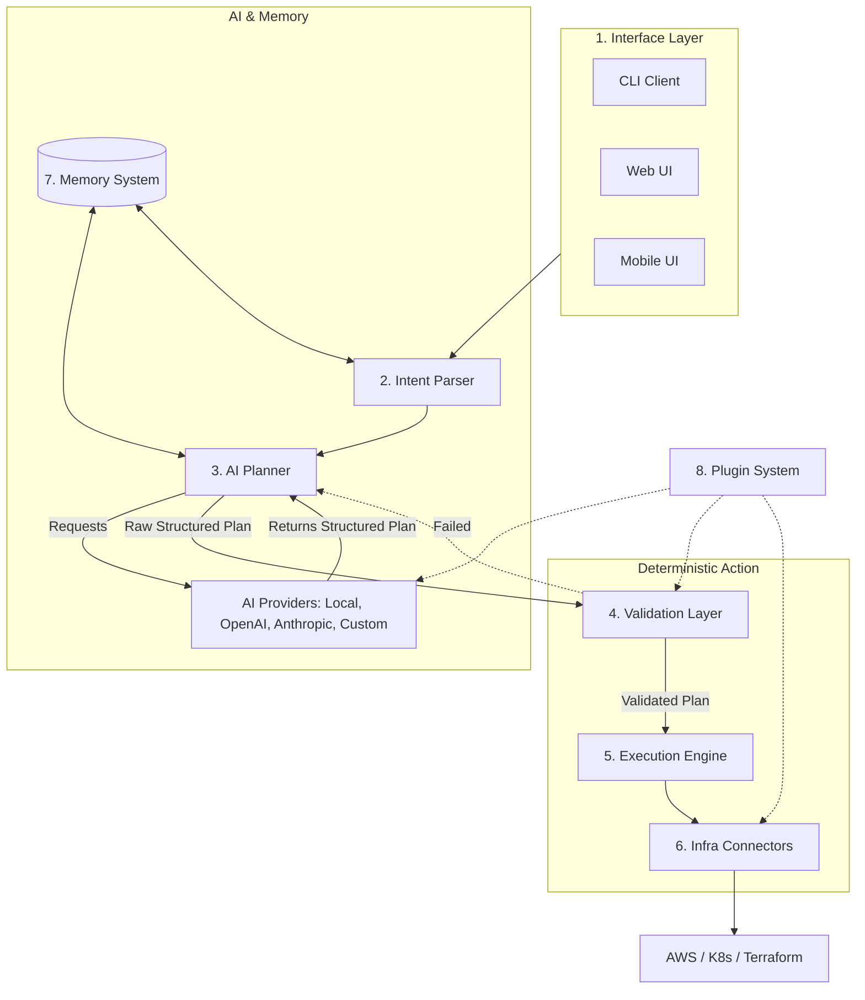

# DevAI Architecture and Implementation Plan

## 1. Project Analysis
DevAI is an open-source platform designed to allow developers to deploy infrastructure and applications using natural language. The system interacts via CLI, Web UI, and eventually Mobile interfaces. It must support local models (via `llama.cpp`) alongside managed models like OpenAI and Anthropic.

The core guiding principle is strict separation of concerns and determinism:
- The **AI** is strictly limited to generating structured, declarative deployment plans based on user intent.
- **Direct shell execution by the AI is strictly forbidden.**
- A **Deterministic Validation Layer** ensures safety, syntax, and schema correctness.
- The **Execution Engine** performs the actual infrastructure state changes deterministically.

## 2. Required System Layers
The architecture is divided into the following 8 core layers:

1. **Interface Layer:** Handles user interactions. Routes input from CLI (e.g., terminal prompts), Web UI (chat UI), and future Mobile apps to the backend.
2. **Intent Parser:** Takes natural language input, understands the context of the user request, and categorizes the intent (e.g., `Deploy`, `Destroy`, `DriftCheck`, `Status`).
3. **AI Planner:** Based on the parsed intent, calls the configured AI Provider to generate a structured deployment plan (e.g., JSON or YAML). It contains no system privileges.
4. **Validation Layer:** A deterministic rules engine. It validates the AI Planner's output against strict schemas, safety policies, and structural requirements. Any invalid plan is rejected and sent back to the AI Planner for correction or returned as an error to the user.
5. **Execution Engine:** Takes the strictly validated, structured plan and orchestrated the deterministic state changes by calling appropriate infrastructure connectors.
6. **Infrastructure Connectors:** The plugins/adapters that talk to actual tools like Terraform, Pulumi, Kubernetes, AWS CLI, or Ansible.
7. **Memory System:** Stores user preferences, previous deployments, resource state, and conversational context to allow for multi-turn planning.
8. **Plugin System:** A dynamic registry allowing the community to inject custom validate rules, new models, or custom infrastructure connectors.

## 3. Architecture Design

## 4. Proposed Development Phases

### Phase 1: Core Foundation & Planning Architecture
- Establish the backend project structure (e.g., Python or Go).
- Define the internal Data Models (Pydantic / Protobuf / Structs) for the "**Structured Plan**".
- Scaffold the 8 architectural layers with mock implementations to establish data flow.

### Phase 2: Interface Layer & AI Planner
- Build the **CLI Interface** to accept user input.
- Implement the **AI Planner** and integrate `llama.cpp` for local evaluation.
- Implement the structured output parsing from the LLM.

### Phase 3: Validation & Execution Engine
- Build the **Validation Layer** with strict schema validation against the AI's output.
- Develop the **Execution Engine** to parse validated plans and map them to basic operations.
- Build the first **Infrastructure Connector** (e.g., a simple Docker container deployer or local config file generator to test safety).

### Phase 4: Integrations & Memory
- Integrate external provider APIs (OpenAI, Anthropic).
- Implement the **Memory System** (e.g., local SQLite base) to retain conversation history and infrastructure state.
- Handle multi-turn deployment conversations (User: "Actually, change the port to 8080").

### Phase 5: Web UI & Plugin System
- Expose the system via a REST/GraphQL API.
- Build the **Web UI** chat interface.
- Finalize the **Plugin System** to allow dynamic loading of custom connectors and validation rules.

## 5. User Review Required (Clarifying Questions)
Please review the questions below to finalize the design before we start coding:
1. **Programming Language/Stack:** Which language do you prefer for the core system? (Python is excellent for AI/CLI, Go is excellent for CLI/Infrastructure. TypeScript is also an option).
2. **Structured Plan Format:** Should the AI component strictly output JSON, or a specific infrastructure DSL (like HCL format)?
3. **Primary Infrastructure Targets:** Which infrastructure connector should we build first for Phase 3 testing (e.g., Docker, Terraform, Kubernetes)?
4. **Data Persistence:** For the Memory System, should we default to a local SQLite database for the CLI, or is there a different preference?
