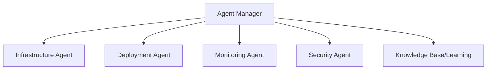

# DevAI Phase 6: Autonomous DevOps Engineer

Phase 6 is the final evolution, transforming DevAI from a platform into an **Autonomous Agent** (similar to a Devin-style agent for DevOps).

## 1. Multi-Agent Architecture

We move from a single AI Planner to specialized agents.

---

## 2. New Modules & Responsibilities

| Module | Location | Responsibility |
|--------|----------|----------------|
| `AgentManager` | `agents/agent_manager.py` | Orchestrates specialized agents |
| `DeploymentAgent` | `agents/deployment_agent.py`| Handles rolling updates & rollbacks |
| `MonitoringAgent`| `agents/monitoring_agent.py`| Threshold analysis & incident reporting |
| `SecurityAgent`  | `agents/security_agent.py`  | Vulnerability scanning & policy audit |
| `KnowledgeBase`  | `learning/knowledge_base.py`| Stores failure patterns and success steps |
| `TaskScheduler`  | `automation/scheduler.py`   | Background cron-like task executor |

---

## 3. Autonomous Feedback Loop

1.  **Observe**: Monitoring Agent detects high latency or crash.
2.  **Reason**: Agent Manager consults Knowledge Base for similar past incidents.
3.  **Plan**: Infrastructure Agent generates a scaling or remediation plan.
4.  **Execute**: Execution Engine applies the fix.
5.  **Learn**: Knowledge Base stores the outcome (Success/Failure).

---

## Proposed Changes

### Multi-Agent Foundation
#### [NEW] [agent_manager.py](file:///f:/github/DevOps-CLI/devai/agents/agent_manager.py)
Registry and orchestration for sub-agents.

#### [NEW] [deployment_agent.py](file:///f:/github/DevOps-CLI/devai/agents/deployment_agent.py)
Logic for autonomous deployment workflows.

#### [NEW] [monitoring_agent.py](file:///f:/github/DevOps-CLI/devai/agents/monitoring_agent.py)
Autonomous health analysis.

### Learning & Automation
#### [NEW] [knowledge_base.py](file:///f:/github/DevOps-CLI/devai/learning/knowledge_base.py)
SQLite or JSON-based storage for incident patterns.

#### [NEW] [scheduler.py](file:///f:/github/DevOps-CLI/devai/automation/scheduler.py)
Task automation engine for background jobs.

---

## 4. CLI Extensions
- `devai agent run <task>`
- `devai agent status`
- `devai knowledge list`
- `devai scheduler list`

---

## Verification Plan

### Automated Tests
- Simulate a service failure and verify the Monitoring Agent triggers a remediation.
- Verify Knowledge Base correctly stores a successful remediation step.
- Test background scheduler execution.

### Manual Verification
- Run `devai agent run "optimize cost for production"` and review the proposed multi-agent plan.
